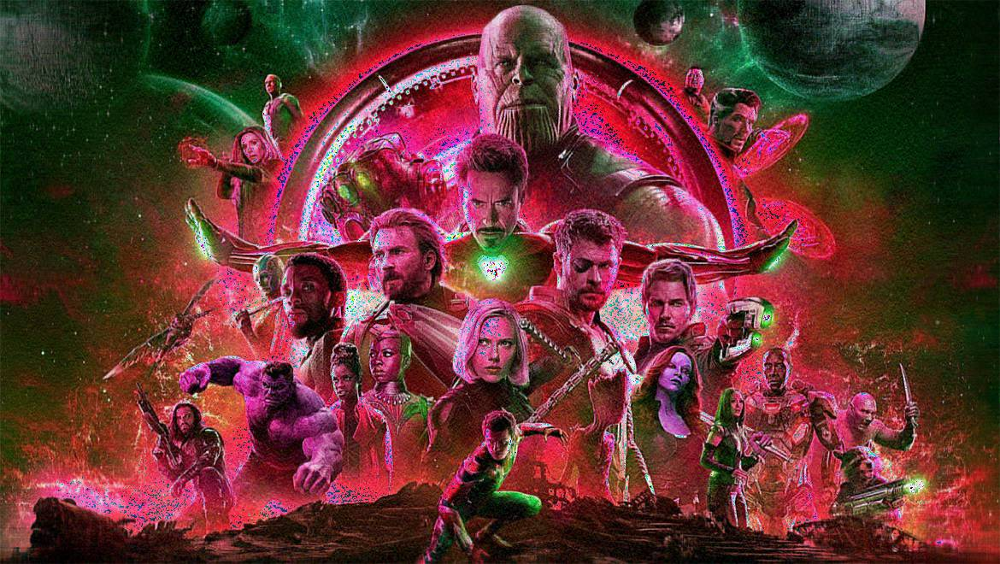

```{r setup, include=FALSE}
knitr::opts_chunk$set(echo = TRUE)
```

# Image Reconstruction using Principal Component Analysis

```{r}
### Image reconstruction using PCA

library(jpeg)

setwd('/Users/Banner/Documents/DataScienceProjects/ImageReconstruction/')

Avengers<-readJPEG('Avengers-Infinity-War.jpg')

```


### Checking the structure of the image

```{r}

str(Avengers)
summary(Avengers)

```

### Separating RGB channels

```{r}

# Red channel

avengers_r<-Avengers[,,1]

#Blue channel
avengers_b<-Avengers[,,2]

#Green channel
avengers_g<-Avengers[,,3]


```

### Principal Components of the Image Data

```{r}

pca_avengers_r <- prcomp(avengers_r, center = F)

pca_avengers_g <- prcomp(avengers_g, center = F)

pca_avengers_b <- prcomp(avengers_b, center = F)


```

### Reconstruction

```{r}
# Reducing the reconstructed image pixels to 1/4th of the original

pxl <- length(Avengers[,1,1])/4

avengers_reconst_r <- pca_avengers_r$x[,1:pxl] %*% t(pca_avengers_r$rotation[,1:pxl])

avengers_reconst_g <- pca_avengers_g$x[,1:pxl] %*% t(pca_avengers_g$rotation[,1:pxl])

avengers_reconst_b <- pca_avengers_b$x[,1:pxl] %*% t(pca_avengers_b$rotation[,1:pxl])

avengers_reconst <- simplify2array(list(avengers_reconst_r, avengers_reconst_g, avengers_reconst_b), higher = T)


```

### Rendering

```{r}

writeJPEG(avengers_reconst, "Avengers_reconst.jpeg")

```

- __Certain areas of the image have incorrect colors but overall it seems quite a decent construction considering having only used a quarter of the original pixels.__



